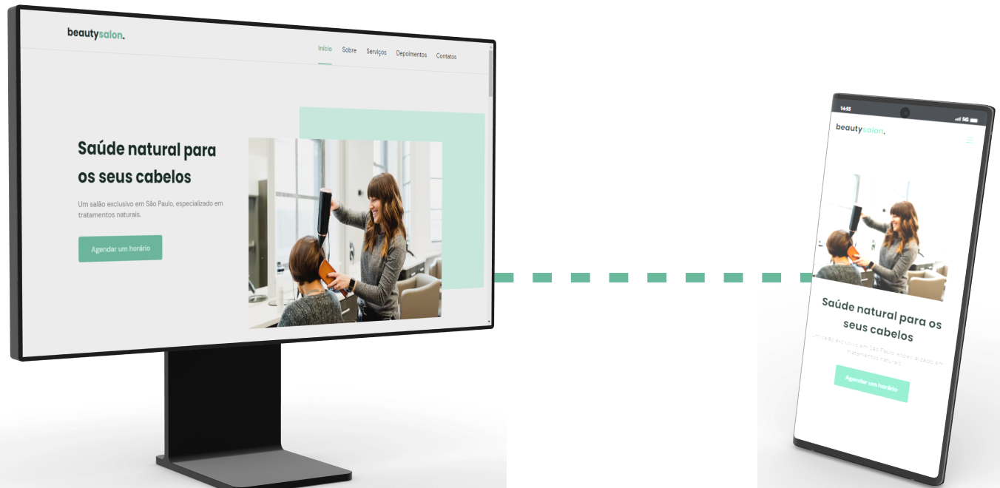

#  beautysalon. - Salão de beleza

> Página desenvolvida no evento online da rocketseat.

## 💻 Funcionalidades

- Menu reativo conforme a pagina
- Botão voltar pra cima
- Carrossel
- Multiplataforma

## 📚 Bibliotecas utilizadas

## ⚙ Tecnologias

   

## 🔗 Links

<a href = "https://t.me/Carloscunha611" target = '_blank'> 
